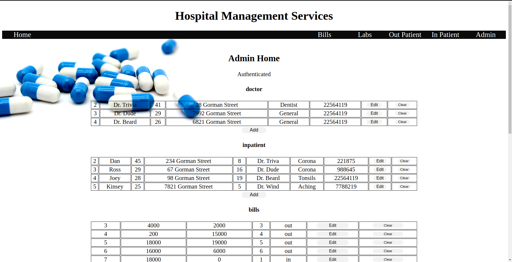

# HManagement  

Designed and coded a web application for hospital management. Can be used to manage in and out patient details, handle accounts and publish lab reports. All the flow can be controlled with the admin section.

## Framework  
Built using Java 11  
Main Web Framework on Servlets  
Web pages and information fetch with JSP  
Server - Tomcat 9  
UI - HTML / CSS / Javascript  
Database - MySQL  

## Running  
Start file index.jsp  
Database will be auto initialized

## Screenshot

